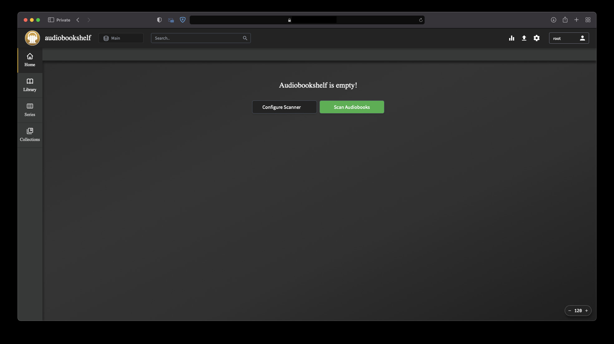

# Audiobookshelf pour YunoHost

[](https://dash.yunohost.org/appci/app/audiobookshelf)    
[](https://install-app.yunohost.org/?app=audiobookshelf)

*[Read this readme in english.](./README.md)*
*[Lire ce readme en français.](./README_fr.md)*

> *Ce package vous permet d'installer Audiobookshelf rapidement et simplement sur un serveur YunoHost.
Si vous n'avez pas YunoHost, regardez [ici](https://yunohost.org/#/install) pour savoir comment l'installer et en profiter.*

## Vue d'ensemble

Audiobookshelf is a self-hosted audiobook server for managing and playing your audiobooks.

### Features

* Fully **open-source**, including the [android & iOS app](https://github.com/advplyr/audiobookshelf-app) *(in beta)*
* Stream all audiobook formats on the fly
* Multi-user support w/ custom permissions
* Keeps progress per user and syncs across devices
* Auto-detects library updates, no need to re-scan
* Upload audiobooks w/ bulk upload drag and drop folders
* Backup your metadata + automated daily backups
* Progressive Web App (PWA)
* Chromecast support on the web app
* Fetch metadata and cover art from several sources

**Version incluse :** 1.7.2~ynh1

**Démo :** https://audiobookshelf.org/

## Captures d'écran



## Avertissements / informations importantes

## Limitations

* Audiobookshelf can only be installed on a dedicated domain
* No LDAP support

## Administration

* Default user is "root" with no password

## Documentations et ressources

* Site officiel de l'app : https://audiobookshelf.org/
* Documentation officielle utilisateur : https://www.audiobookshelf.org/docs
* Documentation officielle de l'admin : https://yunohost.org/packaging_apps
* Dépôt de code officiel de l'app : https://github.com/advplyr/audiobookshelf
* Documentation YunoHost pour cette app : https://yunohost.org/app_audiobookshelf
* Signaler un bug : https://github.com/YunoHost-Apps/audiobookshelf_ynh/issues

## Informations pour les développeurs

Merci de faire vos pull request sur la [branche testing](https://github.com/YunoHost-Apps/audiobookshelf_ynh/tree/testing).

Pour essayer la branche testing, procédez comme suit.
```
sudo yunohost app install https://github.com/YunoHost-Apps/audiobookshelf_ynh/tree/testing --debug
ou
sudo yunohost app upgrade audiobookshelf -u https://github.com/YunoHost-Apps/audiobookshelf_ynh/tree/testing --debug
```

**Plus d'infos sur le packaging d'applications :** https://yunohost.org/packaging_apps