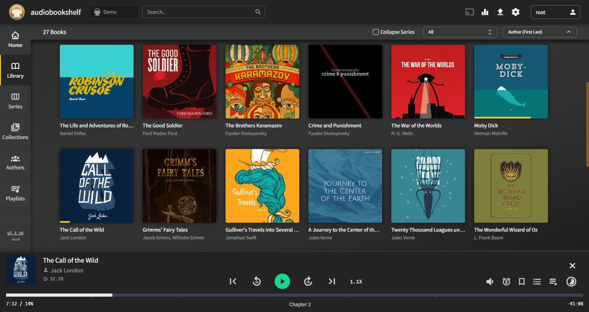

<!--
NOTA: Este README foi creado automáticamente por <https://github.com/YunoHost/apps/tree/master/tools/readme_generator>
NON debe editarse manualmente.
-->

# Audiobookshelf para YunoHost

[](https://ci-apps.yunohost.org/ci/apps/audiobookshelf/)


[](https://install-app.yunohost.org/?app=audiobookshelf)

*[Le este README en outros idiomas.](./ALL_README.md)*

> *Este paquete permíteche instalar Audiobookshelf de xeito rápido e doado nun servidor YunoHost.*  
> *Se non usas YunoHost, le a [documentación](https://yunohost.org/install) para saber como instalalo.*

## Vista xeral

Audiobookshelf is a self-hosted audiobook server for managing and playing your audiobooks.

### Features

* Fully **open-source**, including the [android & iOS app](https://github.com/advplyr/audiobookshelf-app) *(in beta)*
* Stream all audiobook formats on the fly
* Multi-user support w/ custom permissions
* Keeps progress per user and syncs across devices
* Auto-detects library updates, no need to re-scan
* Upload audiobooks w/ bulk upload drag and drop folders
* Backup your metadata + automated daily backups
* Progressive Web App (PWA)
* Chromecast support on the web app
* Fetch metadata and cover art from several sources

**Versión proporcionada:** 2.17.5~ynh1

## Capturas de pantalla



## Documentación e recursos

- Web oficial da app: <https://audiobookshelf.org/>
- Documentación oficial para usuarias: <https://www.audiobookshelf.org/docs>
- Repositorio de orixe do código: <https://github.com/advplyr/audiobookshelf>
- Tenda YunoHost: <https://apps.yunohost.org/app/audiobookshelf>
- Informar dun problema: <https://github.com/YunoHost-Apps/audiobookshelf_ynh/issues>

## Info de desenvolvemento

Envía a túa colaboración á [rama `testing`](https://github.com/YunoHost-Apps/audiobookshelf_ynh/tree/testing).

Para probar a rama `testing`, procede deste xeito:

```bash
sudo yunohost app install https://github.com/YunoHost-Apps/audiobookshelf_ynh/tree/testing --debug
ou
sudo yunohost app upgrade audiobookshelf -u https://github.com/YunoHost-Apps/audiobookshelf_ynh/tree/testing --debug
```

**Máis info sobre o empaquetado da app:** <https://yunohost.org/packaging_apps>
